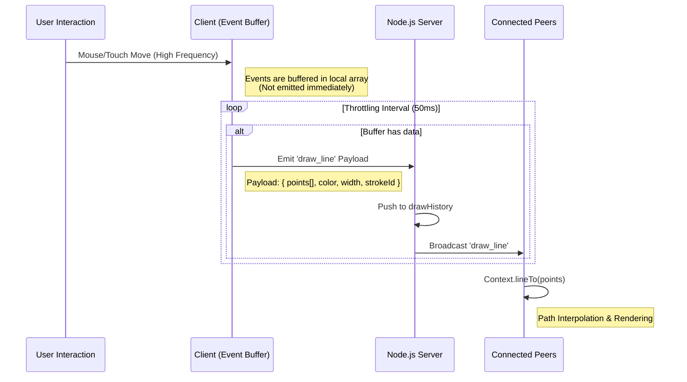

# System Architecture


## Overview
This application utilizes a centralized client-server architecture powered by WebSockets to ensure consistency across multiple connected clients. The core design philosophy prioritizes latency reduction through event batching and state consistency through server-side history management.

## Data Flow Diagram
The following sequence diagram illustrates the lifecycle of a drawing event, from the user's input to the propagation across the network.



```mermaid


```

## Core Logic & Implementation Details

### 1. Network Optimization: Batching & Throttling
Raw DOM events (`mousemove` or `touchmove`) fire at the refresh rate of the device (60Hz to 120Hz). Emitting a WebSocket packet for every event creates significant network overhead and server congestion.

* **Implementation:** The client maintains a `strokeBuffer` array. Input coordinates are pushed to this buffer synchronously.
* **Throttling:** A dedicated `setInterval` loop runs every 50ms. It checks the buffer state; if data exists, it packages all buffered points into a single JSON payload and emits it to the server.
* **Result:** This strategy reduces the frequency of network calls by approximately 80-90% while maintaining visual smoothness through client-side path interpolation.

### 2. State Synchronization: Atomic Stroke Logic
Standard undo implementations typically operate on a LIFO (Last-In, First-Out) stack. In a collaborative environment, a simple stack pop is insufficient because interleaved actions from multiple users would result in User A undoing User B's most recent action.

* **Stroke Identification:** Upon `mousedown`, the client generates a unique `strokeId` (timestamp + random hash). Every packet emitted during that specific drag operation carries this identifier.
* **Server-Side Filtering:** The server maintains the global `drawHistory` array. When an undo request is received:
   1. The server identifies the `strokeId` of the last action performed by the requesting socket.
   2. It performs a filter operation on the `drawHistory` array to remove all packets matching that specific `strokeId`.
   3. The updated history is broadcast to all clients, forcing a complete redraw of the canvas.
* **Benefit:** This ensures atomic removal of a complete user action without corrupting the shared canvas state or affecting other users' contributions.

### 3. Redo Implementation
To support the "Redo" requirement without compromising the real-time nature of the application:

* **The Redo Stack:** The server maintains a separate `redoStack`.
* **Operation:** When an undo occurs, the removed stroke data (an array of packets) is pushed onto the `redoStack`.
* **Restoration:** When a redo is requested, the server pops the stroke data from the `redoStack` and re-inserts it into the `drawHistory`.
* **State Invalidation:** Any new drawing action clears the `redoStack` to prevent branching history conflicts, adhering to standard editor behavior.

### 4. Client-Side Rendering Strategy
To optimize rendering performance and prevent React reconciliation cycles from causing input lag:

* **Direct DOM Manipulation:** The canvas rendering context (`ctx`) is accessed via `useRef` rather than React state.
* **Input Separation:** High-frequency cursor tracking is decoupled from the drawing logic. Cursor updates are broadcast independently to ensure the "Ghost Cursors" remain fluid even if the drawing buffer is processing data.
